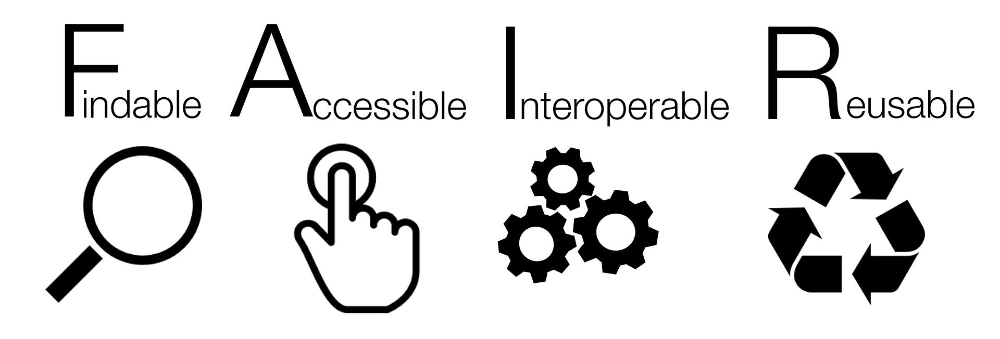

class: inverse, center, middle

# Mis on digiarheoloogia?

---

# Geoinfosüsteemide (GIS) kasutamine

---

# LiDAR andmed 

---

class: inverse, center, middle
# Avatud teadus

---

# Avaandmed

**Avaandmed** (*Open Data*) on vabalt ja avalikult kasutamiseks antud andmed. Avaandmeid võib ilma piiranguteta alla laadida, kasutada ja levitada, juhul kui autorile viidatakse ning andmeid kasutatakse vastavalt litsentsitingimustele.
Avaandmete mõiste on selgelt defineerituna kasutusel olnud kümmekond aastat ning on eriti viimastel aastatel tihedalt seotud survega avalikule sektorile teha oma andmed või osa nendest juurdepääsupiiranguta kättesaadavaks.    
Eesti avaliku sektori avaandmed on tehtud kättesaadavaks [Eesti Avaandmete Portaalis](https://opendata.riik.ee/).

---

# Avaandmed



- Andmete **leitavusele** aitab kaasa masinloetav kuju, metainfo, märksõnad ja püsiidentifikaator DOI.    
- Kui andmeid hoitakse mingis avalikus repositooriumis, kust neid on võimalik alla laadida, on need hästi **kättesaadavad**.   
- Kui andmete vorming vastab standarditele või andmeid hoitakse lihtsalt laialt kasutusel olevas, platvormist sõltumatus vormingus (nt CSV, XML), on need ka hõlpsasti **ristkasutatavad**.   
- Kui andmete kogumise ja töötlemise protsess on põhjalikult dokumenteeritud ning andmed on varustatud litsentsiga, on need ka **taaskasutatavad**.

---

# Avaandmed 

Suuremad rahvusvahelised teadusandmete repositooriumid on näiteks [Zenodo](https://zenodo.org/), [Harvard Dataverse](https://dataverse.harvard.edu/) (vaata ja [teisi *Dataverse*-projekte](https://dataverse.org/)) ja [Figshare](https://figshare.com/). Repositooriume võib omakorda otsida erinevatest registritest, nagu [Re3data.org](https://www.re3data.org/) või [OpenAIRE]( https://explore.openaire.eu/search/advanced/datasets). Tartu Ülikool pakub TÜ Raamatukogu kaudu võimalust säilitada oma teadusandmeid [DataDOI](https://datadoi.ee/) repositooriumis.

---

# Avatud tarkvara

Loetelu ja logod siia 

---

# Reprodutseeritavus ja versioonikontroll

---

# Agendipõhine mudeldamine

Mudel on mingi reaalse süsteemi sihipärane (lihtsustatud) kujutamine.

--

Arvutisimulatsiooni meetod, mis sobib eriti hästi selleks, et uurida ja avastada, kuidas mingi süsteemi koondomadused kerkivad esile selle osade käitumise tulemusena. Need osad on ongi agendid.

--

Arusaam, et suurt osa nähtuseid saab mudeldada kui agente, keskkonda ja nende omavahelisi suhteid.

---

# Kvantitatiivne lähenemine

Tekst siia 

---

# 3D mudeldamine

Näited Ragnarilt ja Asvast

---

# Suhtlus avalikkusega

- Tutulus sotsiaalmeedias
- Must Farm 
- Secrets of the ice

---

# Masinõpe

Artiklite näited

---

# Mis on digiarheoloogia? 

[The Open Digital Archaeology Textbook](https://o-date.github.io/draft/book/)

*Digital archaeology should exist to assist us in the performance of archaeology as a whole. It should not be a secret knowledge, nor a distinct school of thought, but rather simply seen as archaeology done well, using all of the tools available to and in better recovering, understanding and presenting the past. In the end, there is no such thing as digital archaeology. What exists, or at least what should exist, are intelligent and practical ways of applying the use of computers to archaeology that better enable us to pursue both our theoretical questions and our methodological applications. (T. L. Evans, Daly, and MyiLibrary 2006)*

---
class: inverse, middle, center

# Arutelu osa

---

# Küsimused

1. Mis on digiarheoloogia? Kuidas erineb teie arusaam (ka enne raamatu lugemist) raamatu autorite omast? 

2. Milliste raamatus käsitletud probleemidega olete kokku puutunud bakalaureusetööd kirjutades, magistrantuuris või muud arheoloogia-alast tööd tehes? Nt andmed segased või kadunud, palju versioone samast failist, sunnitud kasutama ebasobivat tarkvara, koostöö tegemine ja tulemuste kommunikeerimine keeruline, uurimisteema ja töökorralduse eetilised aspektid? 

<!-- näide failinimedest arvutis -->

---

# Tänan tähelepanu eest! 

andres.kimber@ut.ee

twitter.com/andreskimber


<!-- # Hello Ninja -->

<!-- As a presentation ninja, you certainly should not be satisfied by the "Hello World" example. You need to understand more about two things: -->

<!-- 1. The [remark.js](https://remarkjs.com) library; -->

<!-- 1. The **xaringan** package; -->

<!-- Basically **xaringan** injected the chakra of R Markdown (minus Pandoc) into **remark.js**. The slides are rendered by remark.js in the web browser, and the Markdown source needed by remark.js is generated from R Markdown (**knitr**). -->


<!-- # I was so happy to have discovered remark.js! -->

<!-- --- -->
<!-- class: inverse, middle, center -->

<!-- # Using xaringan -->

<!-- --- -->

<!-- # R Code -->

<!-- ```{r comment='#'} -->
<!-- # a boring regression -->
<!-- fit = lm(dist ~ 1 + speed, data = cars) -->
<!-- coef(summary(fit)) -->
<!-- dojutsu = c('地爆天星', '天照', '加具土命', '神威', '須佐能乎', '無限月読') -->
<!-- grep('天', dojutsu, value = TRUE) -->
<!-- ``` -->

<!-- --- -->

<!-- # R Plots -->

<!-- ```{r cars, fig.height=4, dev='svg'} -->
<!-- par(mar = c(4, 4, 1, .1)) -->
<!-- plot(cars, pch = 19, col = 'darkgray', las = 1) -->
<!-- abline(fit, lwd = 2) -->
<!-- ``` -->

<!-- --- -->

<!-- # Tables -->

<!-- If you want to generate a table, make sure it is in the HTML format (instead of Markdown or other formats), e.g., -->

<!-- ```{r} -->
<!-- knitr::kable(head(iris), format = 'html') -->
<!-- ``` -->


<!-- --- -->

<!-- # Some Tips -->

<!-- - The title slide is created automatically by **xaringan**, but it is just another remark.js slide added before your other slides. -->

<!--     The title slide is set to `class: center, middle, inverse, title-slide` by default. You can change the classes applied to the title slide with the `titleSlideClass` option of `nature` (`title-slide` is always applied). -->

<!--     ```yaml -->
<!--     output: -->
<!--       xaringan::moon_reader: -->
<!--         nature: -->
<!--           titleSlideClass: [top, left, inverse] -->
<!--     ``` -->

<!-- -- -->

<!-- - If you'd like to create your own title slide, disable **xaringan**'s title slide with the `seal = FALSE` option of `moon_reader`. -->

<!--     ```yaml -->
<!--     output: -->
<!--       xaringan::moon_reader: -->
<!--         seal: false -->
<!--     ``` -->

<!-- --- -->

<!-- # Some Tips -->

<!-- - To make slides work offline, you need to download a copy of remark.js in advance, because **xaringan** uses the online version by default (see the help page `?xaringan::moon_reader`). -->

<!-- - You can use `xaringan::summon_remark()` to download the latest or a specified version of remark.js. By default, it is downloaded to `libs/remark-latest.min.js`. -->

<!-- - Then change the `chakra` option in YAML to point to this file, e.g. -->

<!--     ```yaml -->
<!--     output: -->
<!--       xaringan::moon_reader: -->
<!--         chakra: libs/remark-latest.min.js -->
<!--     ``` -->

<!-- - If you used Google fonts in slides (the default theme uses _Yanone Kaffeesatz_, _Droid Serif_, and _Source Code Pro_), they won't work offline unless you download or install them locally. The Heroku app [google-webfonts-helper](https://google-webfonts-helper.herokuapp.com/fonts) can help you download fonts and generate the necessary CSS. -->

<!-- --- -->

<!-- --- -->

<!-- # Themes -->

<!-- Don't want to learn CSS? Okay, you can use some user-contributed themes. A theme typically consists of two CSS files `foo.css` and `foo-fonts.css`, where `foo` is the theme name. Below are some existing themes: -->

<!-- ```{r, R.options=list(width = 70)} -->
<!-- names(xaringan:::list_css()) -->
<!-- ``` -->

<!-- --- -->

<!-- # Themes -->

<!-- To use a theme, you can specify the `css` option as an array of CSS filenames (without the `.css` extensions), e.g., -->

<!-- ```yaml -->
<!-- output: -->
<!--   xaringan::moon_reader: -->
<!--     css: [default, metropolis, metropolis-fonts] -->
<!-- ``` -->