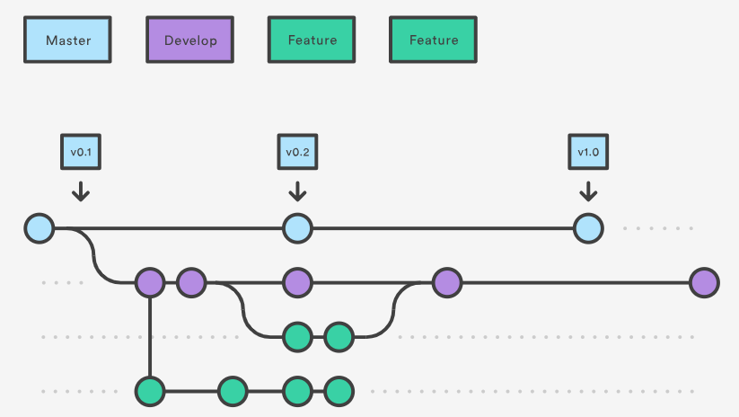

class: inverse, center, middle

# Mis on digiarheoloogia?

Kas lihtsalt arvuti kasutamine arheoloogias? 
Kas digitaalsetel vahenditel ja meetoditel on oma roll?
Oluline on uue avastamine, mitte vana tõestamine arvuti abil?  

---

class: inverse, center, middle
# Avatud teadus

---

# Avaandmed

**Avaandmed** (*Open Data*) on vabalt ja avalikult kasutamiseks antud andmed. Avaandmeid võib ilma piiranguteta alla laadida, kasutada ja levitada, juhul kui autorile viidatakse ning andmeid kasutatakse vastavalt litsentsitingimustele.
Avaandmete mõiste on selgelt defineerituna kasutusel olnud kümmekond aastat ning on eriti viimastel aastatel tihedalt seotud survega avalikule sektorile teha oma andmed või osa nendest juurdepääsupiiranguta kättesaadavaks.    
Eesti avaliku sektori avaandmed on tehtud kättesaadavaks [Eesti Avaandmete Portaalis](https://opendata.riik.ee/).

---

# Avaandmed

- Andmete **leitavusele** aitab kaasa masinloetav kuju, metainfo, märksõnad ja püsiidentifikaator DOI.    
- Kui andmeid hoitakse mingis avalikus repositooriumis, kust neid on võimalik alla laadida, on need hästi **kättesaadavad**.   
- Kui andmete vorming vastab standarditele või andmeid hoitakse lihtsalt laialt kasutusel olevas, platvormist sõltumatus vormingus (nt CSV, XML), on need ka hõlpsasti **ristkasutatavad**.   
- Kui andmete kogumise ja töötlemise protsess on põhjalikult dokumenteeritud ning andmed on varustatud litsentsiga, on need ka **taaskasutatavad**.

---

# Avaandmed 

Suuremad rahvusvahelised teadusandmete repositooriumid on näiteks [Zenodo](https://zenodo.org/), [Harvard Dataverse](https://dataverse.harvard.edu/) (vaata ja [teisi *Dataverse*-projekte](https://dataverse.org/)) ja [Figshare](https://figshare.com/). Repositooriume võib omakorda otsida erinevatest registritest, nagu [Re3data.org](https://www.re3data.org/) või [OpenAIRE]( https://explore.openaire.eu/search/advanced/datasets). Tartu Ülikool pakub TÜ Raamatukogu kaudu võimalust säilitada oma teadusandmeid [DataDOI](https://datadoi.ee/) repositooriumis.

---

# Avatud tarkvara

.pull-left[

]

.pull-right[

]

---

# Avatud tarkvara

.pull-left[

]

.pull-right[

]

---

# Reprodutseeritavus ja versioonikontroll

---

# Reprodutseeritavus ja versioonikontroll

---

# Geoinfosüsteemide (GIS) kasutamine

.pull-left[
- ruumiandmed
- haldamine 
- kogumine 
- esitamine
- mudeldamine
]

.pull-right[
.caption[GISi kihipõhine tööpõhimõte]
]

---

# Geoinfosüsteemide (GIS) kasutamine

.pull-left[.caption[Illinois osariigi ennustav mudel]]

.pull-right[.caption[Asulate paiknemise mudel (Haav 2014)]]

---

# LiDAR andmed 

.caption[Süvahavva kääpad Maa-ameti relfeefivarjutusel (vasakul) ja LiDARi andmetest tehtud täpsemal kõrgusmudelil]

---
# LiDAR andmed 

.caption[Rosma linnamägi LiDARi andmetest tehtud täpsemal kõrgusmudelil]]

---
# LiDAR andmed 

.caption[Täpsema kõrgusmudeli abil avastatud muistsed põllud]]

---

# Agendipõhine mudeldamine

Mudel on mingi reaalse süsteemi sihipärane (lihtsustatud) kujutamine.

--

Arvutisimulatsiooni meetod, mis sobib eriti hästi selleks, et uurida ja avastada, kuidas mingi süsteemi koondomadused kerkivad esile selle osade käitumise tulemusena. Need osad on ongi agendid.

--

Arusaam, et suurt osa nähtuseid saab mudeldada kui agente, keskkonda ja nende omavahelisi suhteid.

---

# Agendipõhine mudeldamine

Alepõllunduse simulatsioon

---

# Agendipõhine mudeldamine

.pull-left[

.caption[]
]

.pull-right[

.caption[]
]

---

# Masinõpe

---

# Archaeogaming

.pull-left[

.caption[]
]

.pull-right[

.caption[]
]

--- 

# Archaeogaming 

---

# Archaeogaming

---

# Muud teemad

- 3D mudeldamine
- public archaeology
  - Tutulus sotsiaalmeedias
  - Must Farm 
  - Secrets of the ice

- statistiline analüüs
- Bayesian modelling

---
class: inverse, middle, center

# Arutelu osa

---

# Küsimused

1. Mis on digiarheoloogia? Kuidas erineb teie arusaam (ka enne raamatu lugemist) raamatu autorite omast? 

2. Milliste raamatus käsitletud probleemidega olete kokku puutunud bakalaureusetööd kirjutades, magistrantuuris või muud arheoloogia-alast tööd tehes? Nt andmed segased või kadunud, palju versioone samast failist, sunnitud kasutama ebasobivat tarkvara, koostöö tegemine ja tulemuste kommunikeerimine keeruline, uurimisteema ja töökorralduse eetilised aspektid? 

---

# Mis on digiarheoloogia? 

[The Open Digital Archaeology Textbook](https://o-date.github.io/draft/book/)

*Digital archaeology should exist to assist us in the performance of archaeology as a whole. It should not be a secret knowledge, nor a distinct school of thought, but rather simply seen as archaeology done well, using all of the tools available to and in better recovering, understanding and presenting the past. In the end, there is no such thing as digital archaeology. What exists, or at least what should exist, are intelligent and practical ways of applying the use of computers to archaeology that better enable us to pursue both our theoretical questions and our methodological applications. (T. L. Evans, Daly, and MyiLibrary 2006)*

---

# Kirjandus

- Gillings, E. M., Hacıgüzeller, P., & Lock, G. (2020). Archaeological Spatial Analysis : A Methodological Guide Archaeology and spatial analysis. https://bookshelf.vitalsource.com/#/books/9781351243834/cfi/6/6!/4/2/2/2/2@0:0
- Wakefield, C. (2020). Digital Public Archaeology at Must Farm: A Critical Assessment of Social Media Use for Archaeological Engagement. Internet Archaeology, 55. https://doi.org/10.11141/ia.55.9
- Wilczek, J., Monna, F., Gabillot, M., Navarro, N., Rusch, L., & Chateau, C. (2015). Unsupervised model-based clustering for typological classification of Middle Bronze Age flanged axes. Journal of Archaeological Science: Reports, 3, 381–391. https://doi.org/10.1016/j.jasrep.2015.06.030
- Grove, M., & Blinkhorn, J. (2020). Neural networks differentiate between Middle and Later Stone Age lithic assemblages in eastern Africa. PLOS ONE, 15(8), e0237528. https://doi.org/10.1371/journal.pone.0237528
- Epstein, J. M., & Axtell, R. L. (1996). Growing Artificial Societies. Social Science from the Bottom Up. MIT Press.
- Gilbert, N. (2008). Agent-Based Models (2nd ed.). Sage Publishing

---
class: inverse, middle, center

# Tänan tähelepanu eest! 

andres.kimber@ut.ee

twitter.com/andreskimber

